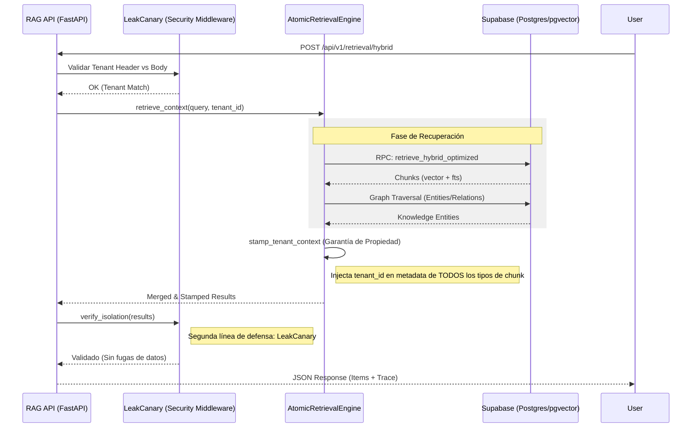

# RAG End-to-End Flow & Security

Este documento detalla el flujo de recuperación de información en el servicio RAG, con especial énfasis en las capas de seguridad y el manejo de metadatos de propiedad (tenancy).

## Arquitectura del Flujo de Retrieval

El motor RAG utiliza un sistema de recuperación híbrido que combina búsqueda vectorial, búsqueda de texto completo (FTS) y grafos de conocimiento.

## Puntos Críticos de Validación

1.  **First Line of Defense (Middleware de Entrada):** Compara el `X-Tenant-ID` del encabezado con el `tenant_id` del cuerpo del mensaje. Si no coinciden, se emite un error `TENANT_MISMATCH`.
2.  **Stamping Contextual:** El método `stamp_tenant_context` en `RetrievalScope` es responsable de asegurar que incluso los datos provenientes de grafos o sumarios (que no traen propiedad desde la DB) sean marcados correctamente con el `tenant_id` del solicitante antes de salir del motor.
3.  **LeakCanary (Last Line of Defense):** Justo antes de enviar la respuesta, el sistema revisa cada item individualmente. Si un item carece de metadatos de propiedad o pertenece a otro tenant, el sistema aborta la petición con una alerta crítica de seguridad.

## Escenarios de Error Comunes

| Error | Causa | Resolución |
| :--- | :--- | :--- |
| `400 TENANT_MISMATCH` | El header no coincide con el body. | Verificar que el cliente envíe el header correcto. |
| `500 SECURITY_ISOLATION_BREACH` | Un chunk se filtró de otro tenant. | Revisar políticas RLS en Postgres o stamping en Python. |
| `No hay evidencia` | Los filtros de scope son demasiado restrictivos. | Revisar metadatos `source_standard` y `tenant_id`. |
