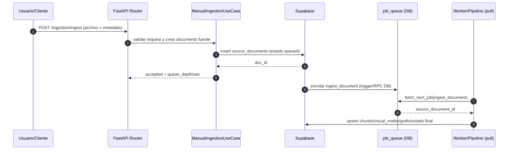
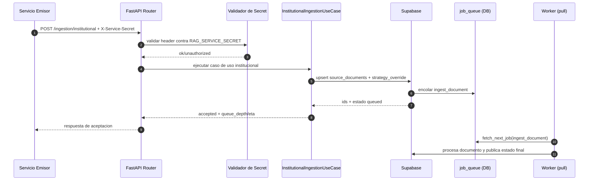
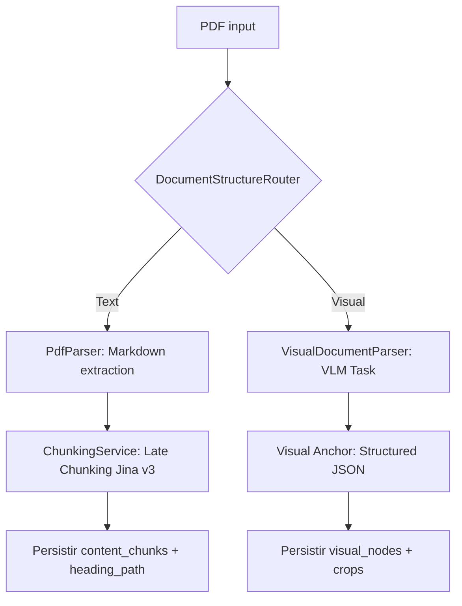
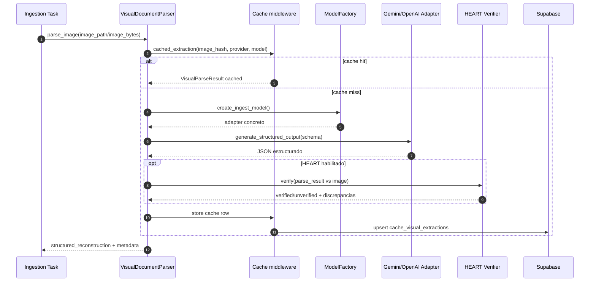
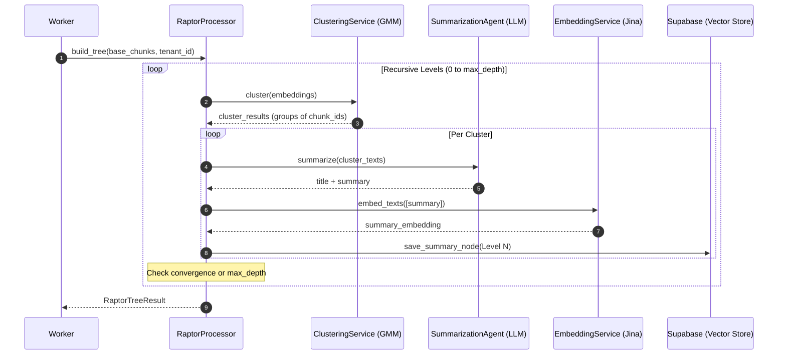
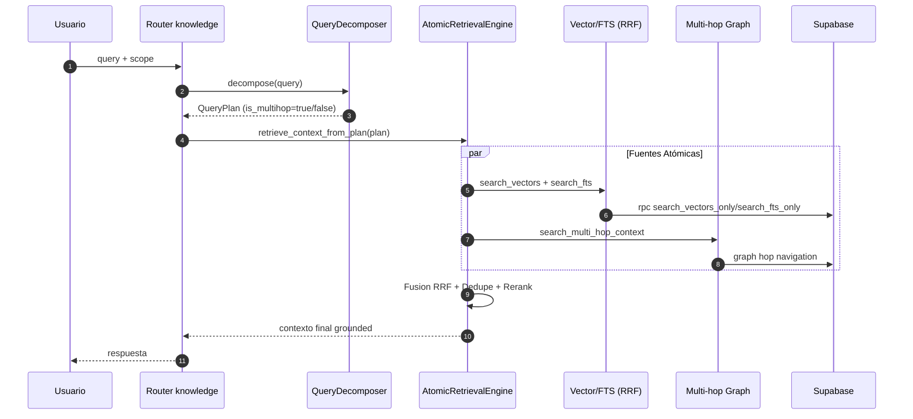
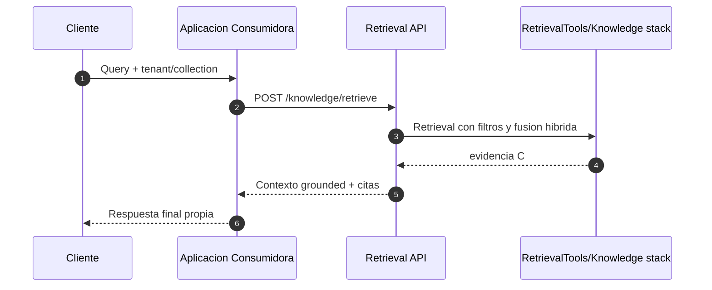
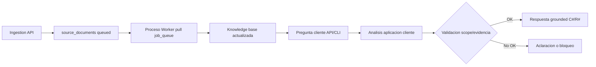
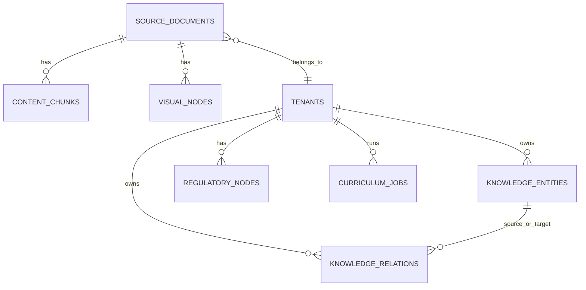

# Flujos y Diagramas (Exactos del Servicio)

Este documento describe los flujos operativos de `rag-engine` usando diagramas Mermaid compatibles con GitHub.

## 1) Vista General del Sistema

```mermaid
flowchart LR
    C[Cliente API] --> A[FastAPI app/main.py]
    A --> R1[/api/v1/ingestion]
    A --> R2[/api/v1/knowledge]

    R1 --> U1[Use Cases de ingesta]
    R2 --> U2[AtomicRetrievalEngine + QueryDecomposer]

    U1 --> S1[Servicios de parsing/chunking/embedding]
    U2 --> S2[Vector/FTS RRF + Multi-hop Graph]

    S1 --> DB[(Supabase Postgres + pgvector)]
    S2 --> DB

    DB --> JQ[(job_queue)]
    JQ --> W[Worker run_worker.py (pull)]
    W --> P[ProcessDocumentWorkerUseCase]
    P --> DB
```

## 2) Flujo Exacto: Ingesta Manual (`POST /api/v1/ingestion/ingest`)



## 3) Flujo Exacto: Ingesta Institucional (`POST /api/v1/ingestion/institutional`)



## 4) Flujo Exacto: Worker Pull Model + Retry

```mermaid
flowchart TD
    A[run_worker.py] --> B[Pollers async]
    B --> C[RPC fetch_next_job(ingest_document)]
    C --> D{Hay job?}
    D -->|No| E[Sleep poll interval]
    D -->|Si| F[Cargar source_document]
    F --> G[Lock por doc_id en memoria]
    G --> H[Semaphore global y por tenant]
    H --> I[ProcessDocumentWorkerUseCase]
    I --> J[Pipeline: parse/chunk/embed/persist]
    J --> K[Opcional: Visual Anchors + RAPTOR + Graph]
    K --> L[Actualizar status y job_queue]
    L --> C
```

## 5) Flujo Exacto: Parsing y Chunking de PDF



## 6) Flujo Exacto: Parsing Visual (Tablas/Figuras)



## 7) Flujo Exacto: RAPTOR (Hierarchical Summarization)



## 8) Flujo Exacto: Retrieval (Atomic Engine)



## 9) Flujo Exacto: Consumo de Retrieval por Cliente Externo



## 10) Flujo Operativo 5 Etapas (Ingestion->Proceso->Pregunta->Analisis->Respuesta)



## 11) Entidades Principales (Simplificado)



## 12) Referencias de Codigo

- API bootstrap: `app/main.py`
- Routers v1: `app/api/v1/api_router.py`
- Ingestion router: `app/api/v1/routers/ingestion.py`
- Knowledge router: `app/api/v1/routers/knowledge.py`
- Worker: `app/worker.py`
- PDF parser: `app/services/ingestion/pdf_parser.py`
- Chunking: `app/services/ingestion/chunking_service.py`
- Visual parser: `app/services/ingestion/visual_parser.py`
- Atomic retrieval: `app/services/retrieval/atomic_engine.py`
- Query decomposition: `app/application/services/query_decomposer.py`
- Retrieval router: `app/application/services/retrieval_router.py`
