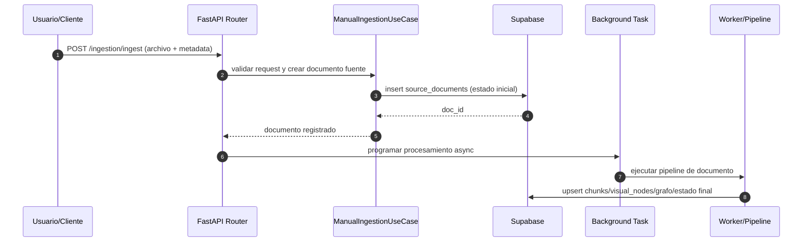
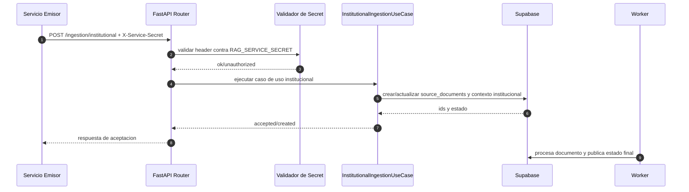
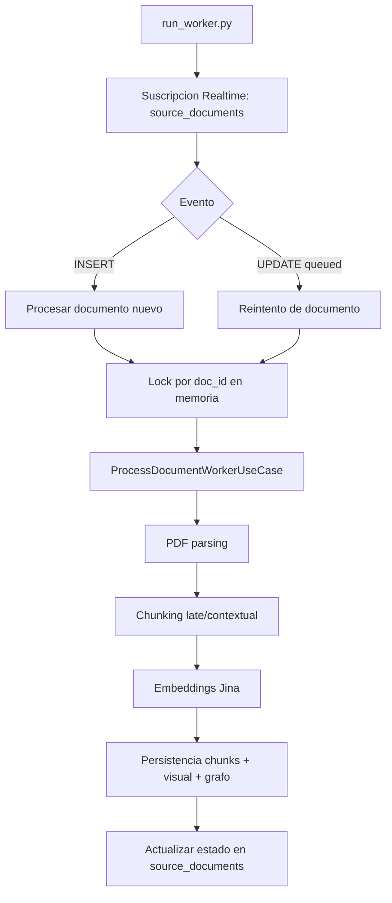
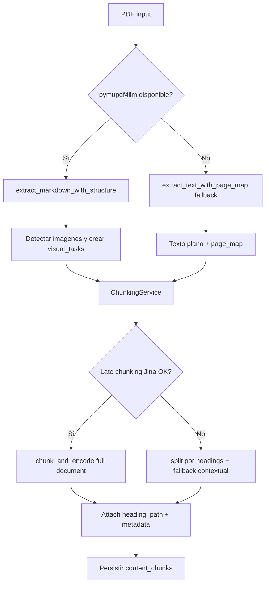
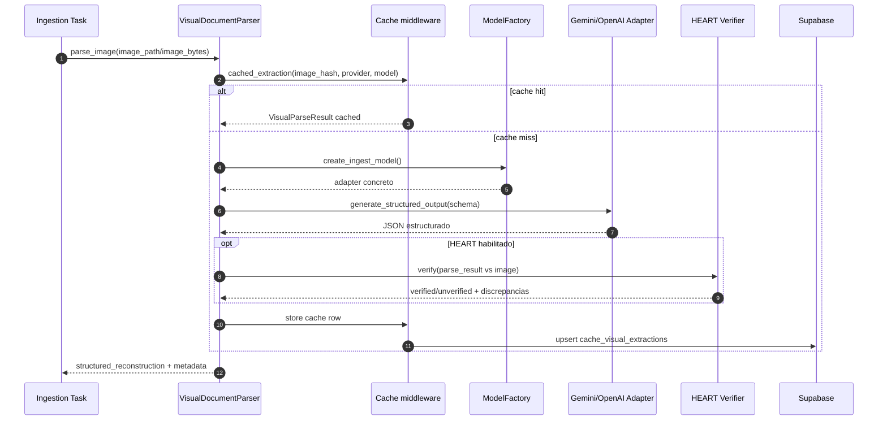
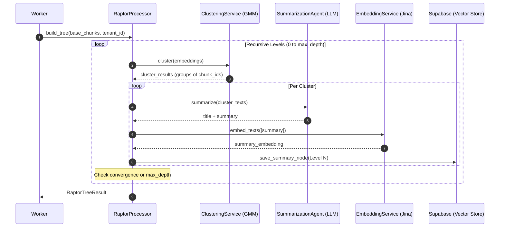
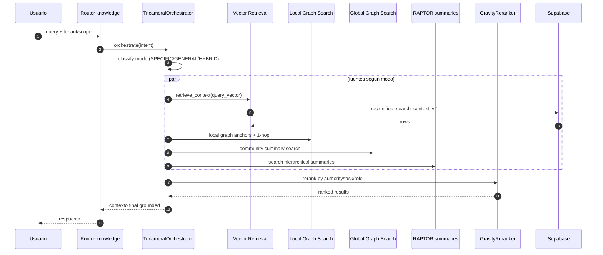
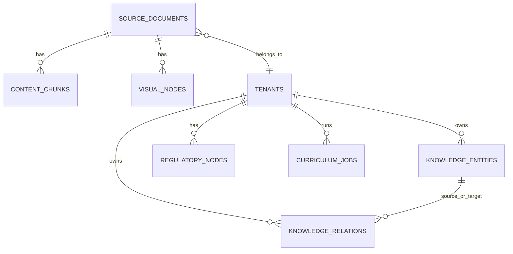

# Flujos y Diagramas (Exactos del Servicio)

Este documento describe los flujos operativos de `rag-ingestion` usando diagramas Mermaid compatibles con GitHub.

## 1) Vista General del Sistema

```mermaid
flowchart LR
    C[Cliente API] --> A[FastAPI app/main.py]
    A --> R1[/api/v1/ingestion]
    A --> R2[/api/v1/knowledge]
    A --> R3[/api/v1/synthesis]
    A --> R4[/api/v1/curriculum (legacy path)]

    R1 --> U1[Use Cases de ingesta]
    R2 --> U2[UnifiedRetrievalEngine + TricameralOrchestrator]
    R3 --> U3[Workflow structured synthesis]
    R4 --> U3

    U1 --> S1[Servicios de parsing/chunking/embedding]
    U2 --> S2[Vector retrieval + GraphRAG + RAPTOR]

    S1 --> DB[(Supabase Postgres + pgvector)]
    S2 --> DB

    DB --> RT[Supabase Realtime]
    RT --> W[Worker run_worker.py]
    W --> P[ProcessDocumentWorkerUseCase]
    P --> DB
```

## 2) Flujo Exacto: Ingesta Manual (`POST /api/v1/ingestion/ingest`)



## 3) Flujo Exacto: Ingesta Institucional (`POST /api/v1/ingestion/institutional`)



## 4) Flujo Exacto: Worker Realtime + Retry



## 5) Flujo Exacto: Parsing y Chunking de PDF



## 6) Flujo Exacto: Parsing Visual (Tablas/Figuras)



## 7) Flujo Exacto: RAPTOR (Hierarchical Summarization)



## 8) Flujo Exacto: Retrieval (`POST /api/v1/knowledge/retrieve`)



## 8) Entidades Principales (Simplificado)



## 9) Referencias de Codigo

- API bootstrap: `rag-ingestion/app/main.py`
- Routers v1: `rag-ingestion/app/api/v1/api_router.py`
- Ingestion router: `rag-ingestion/app/api/v1/routers/ingestion.py`
- Knowledge router: `rag-ingestion/app/api/v1/routers/knowledge.py`
- Worker: `rag-ingestion/app/worker.py`
- PDF parser: `rag-ingestion/app/services/ingestion/pdf_parser.py`
- Chunking: `rag-ingestion/app/services/ingestion/chunking_service.py`
- Visual parser: `rag-ingestion/app/services/ingestion/visual_parser.py`
- Unified retrieval: `rag-ingestion/app/services/retrieval/engine.py`
- Tricameral orchestrator: `rag-ingestion/app/application/services/tricameral_orchestrator.py`
