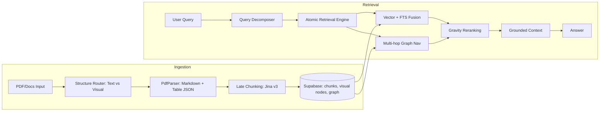
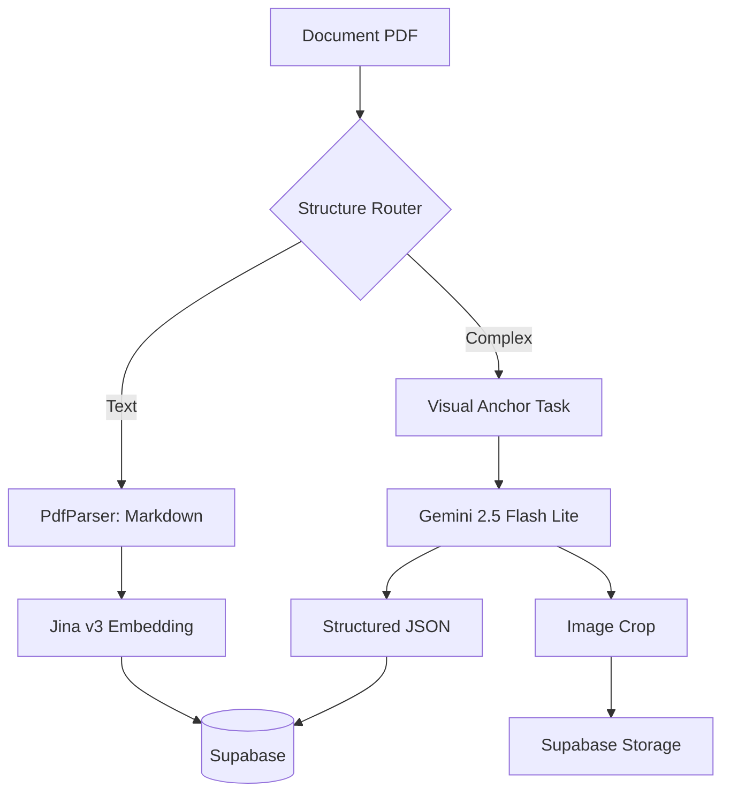

# One-Page Architecture (Executive)

Quick visual overview for GitHub readers.

## 1) End-to-End RAG Flow



## 2) Ingestion Topology (Visual Anchor Pattern)



## 3) Runtime Topology

```mermaid
flowchart TD
    U[Clients / Integrations] --> QAO[Q/A Orchestrator]
    QAO --> AE[Atomic Retrieval Engine]
    AE --> DB[(Supabase Postgres + pgvector)]
    DB --> JQ[(job_queue)]
    JQ --> W[Async Worker (pull)]
    W --> DB

    QAO --> K[Knowledge API]
    QAO --> I[Ingestion API]

    AE --> QP[Query Decomposer]
    AE --> RR[Gravity Reranker]
```

## 4) Boundary Note

- `Q/A Orchestrator` (`app/qa_orchestrator`) decide intencion, plan y validacion.
- RAG backend (`AtomicRetrievalEngine`) ejecuta retrieval atómico sobre múltiples capas (Vector, FTS, Graph).
- Contrato vigente: `docs/qa-orchestrator-rag-boundary-contract.md`.

## Value in one line

Multimodal ingestion + multi-hop atomic retrieval + authority-aware ranking, delivered as an API-first open-source RAG backend.
