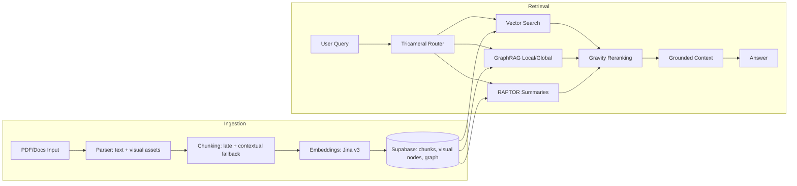
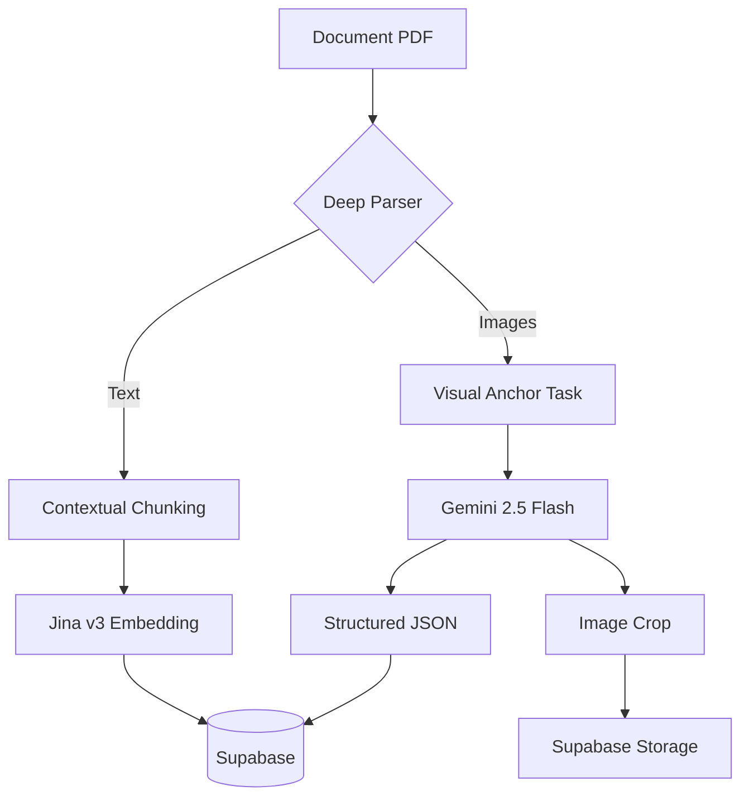
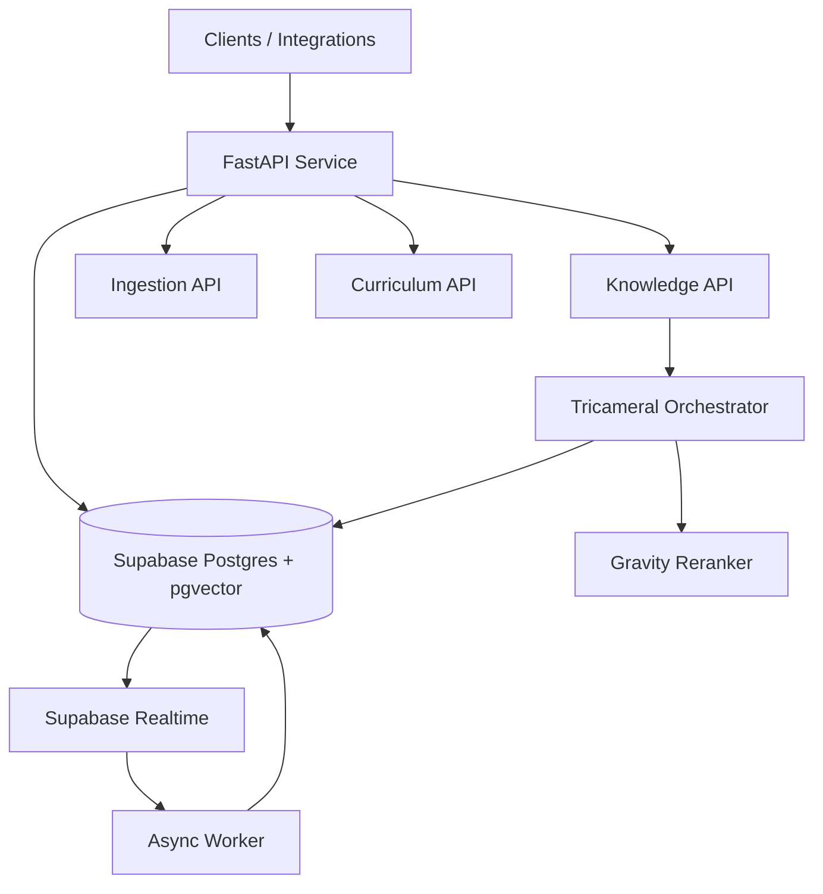

# One-Page Architecture (Executive)

Quick visual overview for GitHub readers.

## 1) End-to-End RAG Flow

## 2) Ingestion Topology (Visual Anchor Pattern)

## 3) Runtime Topology

## Value in one line

Multimodal ingestion + hybrid retrieval + authority-aware ranking, delivered as an API-first open-source RAG backend.
